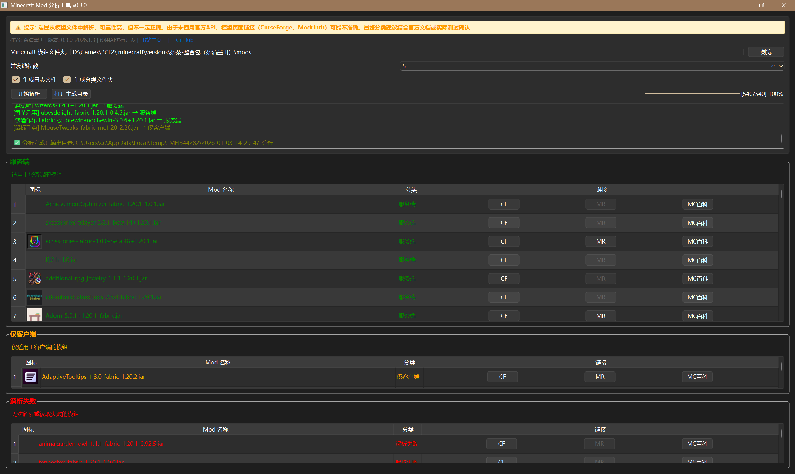

# Minecraft Mod 分析工具

一个用于分析 Minecraft 模组的 Python 工具，可以自动分类服务端和客户端模组。
Tips：exe运行生成的是临时目录，关闭后会消失。

## 功能特性

- 🎯 **自动分析**：解析 mod 的 jar 文件，识别 Fabric 和 Forge 模组
- 📊 **智能分类**：自动将模组分为"服务端"、"仅客户端"和"解析失败"三类
- 🖥️ **GUI 界面**：使用 PyQt6 开发的图形界面，支持拖拽文件夹
- 🔗 **链接生成**：自动生成 CurseForge、Modrinth 和 MC百科 链接
- 🖼️ **图标显示**：显示模组的图标（如果存在）
- 📁 **文件整理**：可选生成分类文件夹，自动复制模组到对应目录
- 📝 **日志记录**：生成详细的文本日志文件

## 界面预览


## 安装和使用

### 环境要求
- Python 3.8+
- 依赖包：
	PyQt6>=6.5.0
	aiohttp>=3.8.0
	见 requirements.txt

### 安装步骤

1. 克隆仓库：
```bash
git clone https://github.com/TeaClearInkII/minecraft-mod-analyzer.git
cd minecraft-mod-analyzer