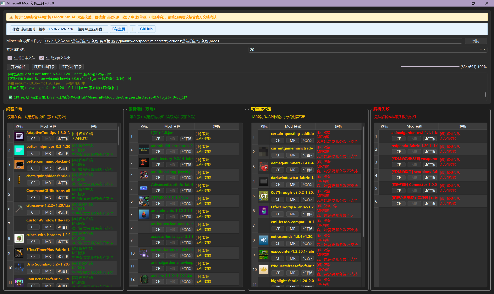

# Minecraft Mod 分析工具

一个用于分析 Minecraft 模组端属的 Python 工具，支持 Fabric、Forge、Quilt 模组，结合本地 JAR 解析和 Modrinth API 双重校验，自动分类并输出带置信度的分析结果。

## 功能特性

- 🎯 **多加载器支持**：解析 Fabric（fabric.mod.json）、Forge（mods.toml）、Quilt（quilt.mod.json）
- 📊 **四类智能分类**：纯客户端 / 服务端(+双端) / 可信度不足 / 解析失败
- 🔍 **Modrinth API 双重校验**：SHA1 哈希精确匹配 → 模糊搜索降级，输出客户端/服务端侧标注
- ⚖️ **决策矩阵 + 置信度**：综合 JAR 解析与 API 结果，输出高/中/低三档可信度
- 🧠 **启发式检测**：元数据模糊时扫描 JAR 内 client/server 路径辅助判断
- 🖥️ **GUI 界面**：PyQt6 图形界面，支持文件夹拖入、分析目录一键直达
- 🔗 **链接生成**：自动生成 CurseForge、Modrinth、MC百科 链接
- 🖼️ **图标显示**：提取并展示模组图标
- 📁 **文件整理**：按分类自动复制模组到对应目录
- 📝 **日志记录**：生成文本日志 + 结构化 JSON 日志（含每条模组的详细分析数据）
- ⚙️ **配置持久化**：线程数、选项设置自动保存至 config.json

## 界面预览

## 下载安装

从 [Releases](https://github.com/TeaClearInkII/Minecraft-ModSide-Analyzer/releases) 下载最新 EXE，双击即可运行，无需安装 Python 或任何依赖。

### 环境要求（源码运行）
- Python 3.8+
- 依赖：`pip install -r requirements.txt`
- 详细见 requirements.txt

## 使用说明

1. 选择或拖入 Minecraft 模组文件夹
2. （可选）调整并发线程数
3. 勾选是否生成日志文件 / 分类文件夹
4. 点击「开始解析」等待完成
5. 结果会按分类显示在表格中，点击链接按钮跳转对应页面
6. 可通过「打开分析目录」查看所有历史分析文件

## 更新日志

### v0.5.0 --2026.07.16--
1. 新增 Modrinth API 双重校验（SHA1 哈希匹配 + 模糊搜索降级）
2. 新增 cross_validate() 决策矩阵，输出 4 类结果 + 置信度（高/中/低）
3. 新增 Quilt 模组解析支持（quilt.mod.json）
4. 新增启发式检测：JAR 解析模糊时扫描 client/server 路径辅助判断
5. 新增 config.json 配置持久化，自动保存线程数、日志/文件夹选项
6. 作者信息栏改为醒目蓝色横幅样式，加粗大字号显示
7. 表格改为左右分栏 + 3 列布局（图标/名称含内嵌按钮/解析含置信度）
8. 新增「打开分析目录」按钮，一键直达 EXE 所在目录查看历史分析文件
9. 修复 PyInstaller 打包后路径指向临时目录的问题，config 和日志输出到 EXE 同目录
10. 修复 Windows 非主线程 asyncio 卡死问题

### v0.3.0 --2026.01.03--
1. 初始版本发布，支持 Fabric / Forge 模组解析
2. 三分类（服务端/仅客户端/解析失败）
3. 基础 GUI 界面，支持拖拽和文件夹选择
4. 生成分类文件夹和文本日志
